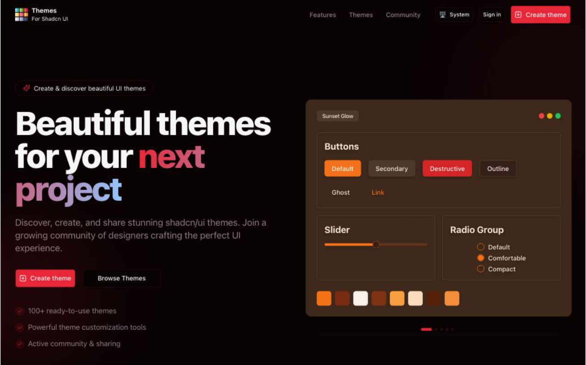

# Shadcn UI Themes

Beautiful themes for your next project. Discover, create, and share stunning shadcn/ui themes. Join a growing community of designers creating colorful UI themes.



## 🌟 Features

- **Theme Explorer**: Browse and discover beautiful shadcn/ui themes
- **Theme Creator**: Create and customize your own themes with a visual editor
- **Community Sharing**: Share your themes with the community
- **Theme Preview**: See your themes in action with various UI components
- **User Profiles**: View themes created by specific users
- **Responsive Design**: Works on all devices

## 🚀 Tech Stack

- **Framework**: [Next.js 15](https://nextjs.org/) with App Router and React 19
- **Authentication**: [NextAuth.js v5](https://next-auth.js.org/)
- **Database**: [Prisma](https://www.prisma.io/) with Supabase
- **UI Components**: [shadcn/ui](https://ui.shadcn.com/)
- **Styling**: [Tailwind CSS](https://tailwindcss.com/)
- **State Management**: [Zustand](https://github.com/pmndrs/zustand)
- **Data Fetching**: [TanStack Query](https://tanstack.com/query)
- **Form Handling**: [React Hook Form](https://react-hook-form.com/) with [Zod](https://zod.dev/)
- **Icons**: [Lucide React](https://lucide.dev/)
- **Editor**: [Monaco Editor](https://microsoft.github.io/monaco-editor/)
- **Charts**: [Recharts](https://recharts.org/)
- **Notifications**: [Sonner](https://sonner.emilkowal.ski/)

## 📋 Prerequisites

- Node.js 18+
- npm, yarn, pnpm, or bun

## 🛠️ Getting Started

1. **Clone the repository**

```bash
git clone https://github.com/satishkumarsajjan/shadcn-ui-themes.git
cd shadcn-ui-themes
```

2. **Install dependencies**

```bash
npm install
# or
yarn install
# or
pnpm install
# or
bun install
```

3. **Set up environment variables**

Create a `.env.local` file in the root directory with the following variables:

# Environment Variables

This project requires several environment variables to be set up for proper functionality. Create a `.env.local` file in the root of your project with the following variables:

## Authentication

```
# Required secret for NextAuth.js
AUTH_SECRET="your-auth-secret"

# GitHub OAuth credentials
AUTH_GITHUB_ID=your-github-client-id
AUTH_GITHUB_SECRET=your-github-client-secret
AUTH_GITHUB_CALLBACK_URL=your-github-callback-url

# Google OAuth credentials
AUTH_GOOGLE_ID=your-google-client-id
AUTH_GOOGLE_SECRET=your-google-client-secret

# NextAuth.js configuration
NEXTAUTH_URL=your-app-url
AUTH_URL=your-app-url
AUTH_TRUST_HOST=true
```

## API Configuration

```
# API URLs
NEXT_PUBLIC_API_BASE_URL='your-api-base-url'
NEXT_PUBLIC_BASE_URL='your-app-base-url'
```

## Database

```
# Database connection string
DATABASE_URL="your-database-connection-string"
```

## Analytics

```
# Google Analytics ID
GAID="your-google-analytics-id"
```

## Getting Started

1. Copy the above template to a new file named `.env.local` in your project root
2. Replace the placeholder values with your actual credentials
3. Make sure to add `.env.local` to your `.gitignore` file to avoid exposing sensitive information

Note: Never commit your actual secrets or API keys to version control.

4. **Run database migrations**

```bash
npx prisma migrate dev
```

5. **Start the development server**

```bash
npm run dev
# or
yarn dev
# or
pnpm dev
# or
bun dev
```

Open [http://localhost:3000](http://localhost:3000) with your browser to see the result.

## 🌐 Deployment

The easiest way to deploy your Next.js app is to use the [Vercel Platform](https://vercel.com/new) from the creators of Next.js.

Check out the [Next.js deployment documentation](https://nextjs.org/docs/app/building-your-application/deploying) for more details.

## 🤝 Contributing

Contributions are welcome! Please feel free to submit a Pull Request.

1. Fork the repository
2. Create your feature branch (`git checkout -b feature/amazing-feature`)
3. Commit your changes (`git commit -m 'Add some amazing feature'`)
4. Push to the branch (`git push origin feature/amazing-feature`)
5. Open a Pull Request

## 📝 License

This project is licensed under the MIT License - see the LICENSE file for details.

## 👨‍💻 Author

- **Satishkumar** - [@iamsatish4564](https://x.com/iamsatish4564)

## 🙏 Acknowledgments

- [shadcn/ui](https://ui.shadcn.com/) for the amazing component library
- [Vercel](https://vercel.com) for the hosting and inspiration
- All the open-source libraries that made this project possible
